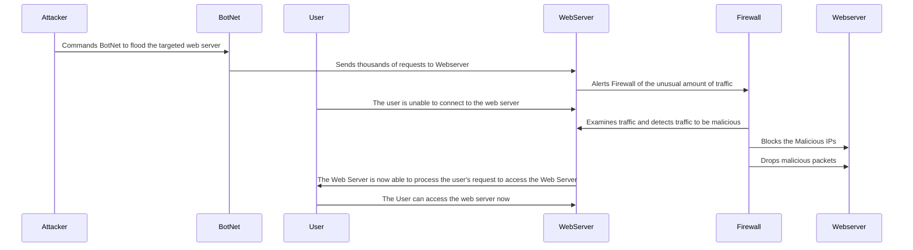

#Documentation

## Explanation to SequenceDiagram Steps

**_1._** **Attacker Remotely Instructs Botnet**: The attacker remotely instructs the botnet to flood the targeted web server for a DDOS attack.

**_2._** **The Botnet Floods The Webserver**: The botnet follows the attacker's instructions and floods the web server with thousands of requests.

**_3._** **Webserver Detects Unusual Amounts of Traffic**: The web server detects an unusual amount of traffic, which exceeds the normal number of requests by far.

**_4._** **User Tries to Access Webserver**: A user wants to access the web server but is unable to connect to the web server due to the DDOS attack, leaving the user frustrated.

**_5._** **Firewall Examines Traffic**: The firewall sees the web server's plea for help and starts to look into the unusual amount of traffic and it determines that the traffic is malicious.

**_6._** **Firewall Blocks the Malcious Botnet**: The firewall blocks all of the botnet IPs that are generating too many requests.

**_7._** **Firewall drops all of the malicious packets**: The firewall also goes and drops all of the packets that it deems to be malicious, this helps out even more with mitigating the DDOS attack

**_8._** **Webserver is Now Able to Process User Requests Again**: The web server is now able to process the user's request to access the web server due to the firewall stopping the DDOS attack.

**_9._** **The User is Now Able to Access The Web Server**: After not being able to access the web server the first time, the user tries again and is successful.
