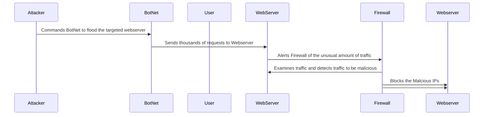

#Documentation

## Explanation to SequenceDiagram Steps

**_1._** **Attacker Remotely Instructs Botnet**: The attacker remotely instructs the botnet to flood the targeted webserver for a DDOS attack.

**_2._** ****

**_3._** ****

**_4._** ****

**_5._** ****

**_6._** ****

**_7._** ****

**_8._** ****
